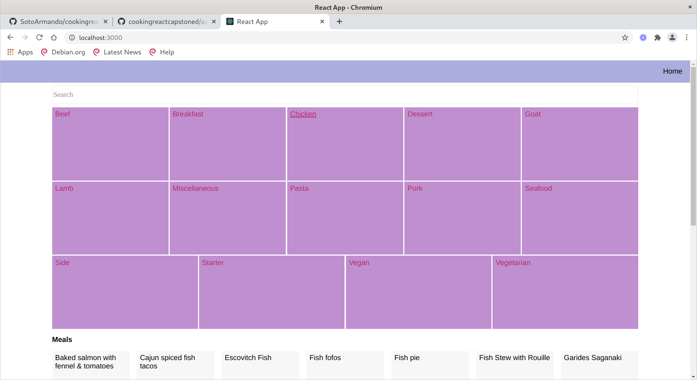

# Project Name

This project is about cooking and its up to allow users to keep updated with specific dates and meals, and also having a fair amount of utilities that 
allows cooking for simpler.

- Features
- Read & Consult Recipes
- Consult & References Categories

[TODO]
- Alarms
- Grocery Lists
- Recipe Step Assistant
- User Scope Sessions to persist on changes and updates

## Built With

- Javascript ES6,
- JSX,
- React & Redux

## Live Demo

[Live Demo Link](https://livedemo.com)

## Getting Started

**This is an example of how you may give instructions on setting up your project locally.**
**Modify this file to match your project, remove sections that don't apply. For example: delete the testing section if the currect project doesn't require testing.**

To get a local copy up and running follow these simple example steps.

### Usage
  - git clone https://github.com/SotoArmando/cookingreactcapstoned
  - git checkout feature_dothiscookingsite
  - npm install
  - npm run
### Run tests
  - git clone https://github.com/SotoArmando/cookingreactcapstoned
  - git checkout feature_dothiscookingsite
  - npm install
  - npm test

## Authors

👤 **Sotoarmando**

- Github: [@githubhandle](https://github.com/SotoArmando)

## 🤝 Contributing

Contributions, issues and feature requests are welcome!

Feel free to check the [issues page](issues/).

## Show your support

Give a ⭐️ if you like this project!

## Acknowledgments

- Hat tip to anyone whose code was used
- Inspiration
- etc

## 📝 License

This project is [MIT](lic.url) licensed.
